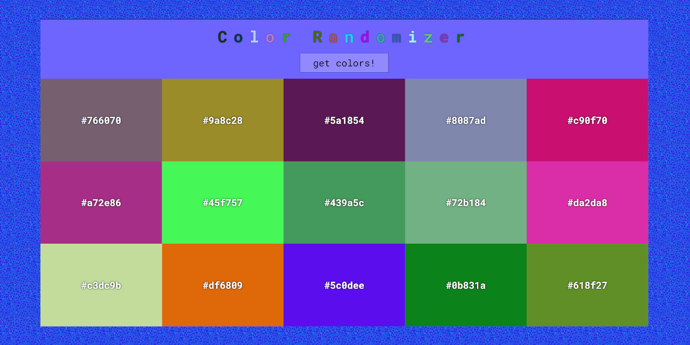

# Color Randomizer
> Available on [GitHub Pages](https://krylak123.github.io/color-randomizer/)

## General info
The purpose of the project is expand a programming knowledge in JavaScript.

## Screenshots

## Technologies
* HTML - version 5
* SCSS
* JavaScript - ECMA6

## Status
Project is _finished_